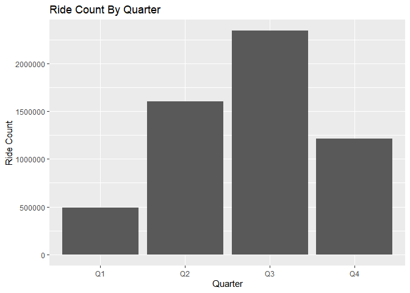

Google Data Analytics Course Capstone Project
================
Osarenoma Abu


### Introdction

Cyclistic, in 2016, launched a successful bike-share offering. Since
that time, the program has grown to a fleet of 5,824 bicycles that are
geotracked and locked into a network of 692 stations across Chicago. The
bikes can be unlocked from one station and returned to any other station
in the system anytime. Until now, Cyclistic’s marketing strategy relied
on building general awareness and appealing to broad consumer segments.
The company has 3 flexible pricing plans: single-ride passes, full-day
passes, and annual memberships. Customers who purchase single-ride or
full-day passes are referred to as casual riders. Customers who purchase
annual memberships are Cyclistic members. The finance team have
concluded that annual members are much more profitable than casual
riders. I assume the position of a junior data analyst in the marketing
analyst team. The marketing analyst team needs to better understand how
annual members and casual riders differ in their use of the Cyclistic
bikes, so as to design new marketing strategies aimed at converting
casual riders into annual members.

#### Business Task

Use Cyclistic’s historical trip data to analyze and understand trends of
the 2 customer types.

### Install and Load the Required Packages.

``` r
library(tidyverse)
library(lubridate)
library(ggplot2)
library(skimr)
library(janitor)
library(stringr)
library(readr)
```

### Install and Load the Data.

``` r
trip_1 <- read_csv("202105_tripdata.csv")
```

    ## Rows: 531633 Columns: 13
    ## ── Column specification ────────────────────────────────────────────────────────
    ## Delimiter: ","
    ## chr  (7): ride_id, rideable_type, start_station_name, start_station_id, end_...
    ## dbl  (4): start_lat, start_lng, end_lat, end_lng
    ## dttm (2): started_at, ended_at
    ## 
    ## ℹ Use `spec()` to retrieve the full column specification for this data.
    ## ℹ Specify the column types or set `show_col_types = FALSE` to quiet this message.

``` r
trip_2 <- read_csv("202106_tripdata.csv")
```

    ## Rows: 729595 Columns: 13
    ## ── Column specification ────────────────────────────────────────────────────────
    ## Delimiter: ","
    ## chr  (7): ride_id, rideable_type, start_station_name, start_station_id, end_...
    ## dbl  (4): start_lat, start_lng, end_lat, end_lng
    ## dttm (2): started_at, ended_at
    ## 
    ## ℹ Use `spec()` to retrieve the full column specification for this data.
    ## ℹ Specify the column types or set `show_col_types = FALSE` to quiet this message.

``` r
trip_3 <- read_csv("202107_tripdata.csv")
```

    ## Rows: 822410 Columns: 13
    ## ── Column specification ────────────────────────────────────────────────────────
    ## Delimiter: ","
    ## chr  (7): ride_id, rideable_type, start_station_name, start_station_id, end_...
    ## dbl  (4): start_lat, start_lng, end_lat, end_lng
    ## dttm (2): started_at, ended_at
    ## 
    ## ℹ Use `spec()` to retrieve the full column specification for this data.
    ## ℹ Specify the column types or set `show_col_types = FALSE` to quiet this message.

``` r
trip_4 <- read_csv("202108_tripdata.csv")
```

    ## Rows: 804352 Columns: 13
    ## ── Column specification ────────────────────────────────────────────────────────
    ## Delimiter: ","
    ## chr  (7): ride_id, rideable_type, start_station_name, start_station_id, end_...
    ## dbl  (4): start_lat, start_lng, end_lat, end_lng
    ## dttm (2): started_at, ended_at
    ## 
    ## ℹ Use `spec()` to retrieve the full column specification for this data.
    ## ℹ Specify the column types or set `show_col_types = FALSE` to quiet this message.

``` r
trip_5 <- read_csv("202109_tripdata.csv")
```

    ## Rows: 756147 Columns: 13
    ## ── Column specification ────────────────────────────────────────────────────────
    ## Delimiter: ","
    ## chr  (7): ride_id, rideable_type, start_station_name, start_station_id, end_...
    ## dbl  (4): start_lat, start_lng, end_lat, end_lng
    ## dttm (2): started_at, ended_at
    ## 
    ## ℹ Use `spec()` to retrieve the full column specification for this data.
    ## ℹ Specify the column types or set `show_col_types = FALSE` to quiet this message.

``` r
trip_6 <- read_csv("202110_tripdata.csv")
```

    ## Rows: 631226 Columns: 13
    ## ── Column specification ────────────────────────────────────────────────────────
    ## Delimiter: ","
    ## chr  (7): ride_id, rideable_type, start_station_name, start_station_id, end_...
    ## dbl  (4): start_lat, start_lng, end_lat, end_lng
    ## dttm (2): started_at, ended_at
    ## 
    ## ℹ Use `spec()` to retrieve the full column specification for this data.
    ## ℹ Specify the column types or set `show_col_types = FALSE` to quiet this message.

``` r
trip_7 <- read_csv("202111_tripdata.csv")
```

    ## Rows: 359978 Columns: 13
    ## ── Column specification ────────────────────────────────────────────────────────
    ## Delimiter: ","
    ## chr  (7): ride_id, rideable_type, start_station_name, start_station_id, end_...
    ## dbl  (4): start_lat, start_lng, end_lat, end_lng
    ## dttm (2): started_at, ended_at
    ## 
    ## ℹ Use `spec()` to retrieve the full column specification for this data.
    ## ℹ Specify the column types or set `show_col_types = FALSE` to quiet this message.

``` r
trip_8 <- read_csv("202112_tripdata.csv")
```

    ## Rows: 247540 Columns: 13
    ## ── Column specification ────────────────────────────────────────────────────────
    ## Delimiter: ","
    ## chr  (7): ride_id, rideable_type, start_station_name, start_station_id, end_...
    ## dbl  (4): start_lat, start_lng, end_lat, end_lng
    ## dttm (2): started_at, ended_at
    ## 
    ## ℹ Use `spec()` to retrieve the full column specification for this data.
    ## ℹ Specify the column types or set `show_col_types = FALSE` to quiet this message.

``` r
trip_9 <- read_csv("202201_tripdata.csv")
```

    ## Rows: 103770 Columns: 13
    ## ── Column specification ────────────────────────────────────────────────────────
    ## Delimiter: ","
    ## chr  (7): ride_id, rideable_type, start_station_name, start_station_id, end_...
    ## dbl  (4): start_lat, start_lng, end_lat, end_lng
    ## dttm (2): started_at, ended_at
    ## 
    ## ℹ Use `spec()` to retrieve the full column specification for this data.
    ## ℹ Specify the column types or set `show_col_types = FALSE` to quiet this message.

``` r
trip_10 <- read_csv("202202_tripdata.csv")
```

    ## Rows: 115609 Columns: 13
    ## ── Column specification ────────────────────────────────────────────────────────
    ## Delimiter: ","
    ## chr  (7): ride_id, rideable_type, start_station_name, start_station_id, end_...
    ## dbl  (4): start_lat, start_lng, end_lat, end_lng
    ## dttm (2): started_at, ended_at
    ## 
    ## ℹ Use `spec()` to retrieve the full column specification for this data.
    ## ℹ Specify the column types or set `show_col_types = FALSE` to quiet this message.

``` r
trip_11 <- read_csv("202203_tripdata.csv")
```

    ## Rows: 284042 Columns: 13
    ## ── Column specification ────────────────────────────────────────────────────────
    ## Delimiter: ","
    ## chr  (7): ride_id, rideable_type, start_station_name, start_station_id, end_...
    ## dbl  (4): start_lat, start_lng, end_lat, end_lng
    ## dttm (2): started_at, ended_at
    ## 
    ## ℹ Use `spec()` to retrieve the full column specification for this data.
    ## ℹ Specify the column types or set `show_col_types = FALSE` to quiet this message.

``` r
trip_12 <- read_csv("202204_tripdata.csv")
```

    ## Rows: 371249 Columns: 13
    ## ── Column specification ────────────────────────────────────────────────────────
    ## Delimiter: ","
    ## chr  (7): ride_id, rideable_type, start_station_name, start_station_id, end_...
    ## dbl  (4): start_lat, start_lng, end_lat, end_lng
    ## dttm (2): started_at, ended_at
    ## 
    ## ℹ Use `spec()` to retrieve the full column specification for this data.
    ## ℹ Specify the column types or set `show_col_types = FALSE` to quiet this message.

``` r
all_trips <- bind_rows(trip_1, trip_2,trip_3, trip_4, trip_5, trip_6, trip_7, trip_8, trip_9, trip_10, trip_11, trip_12)
```

### Data Structure.

``` r
head(all_trips)
```

    ## # A tibble: 6 × 13
    ##   ride_id rideable_type started_at          ended_at            start_station_n…
    ##   <chr>   <chr>         <dttm>              <dttm>              <chr>           
    ## 1 C809ED… electric_bike 2021-05-30 11:58:15 2021-05-30 12:10:39 <NA>            
    ## 2 DD59FD… electric_bike 2021-05-30 11:29:14 2021-05-30 12:14:09 <NA>            
    ## 3 0AB83C… electric_bike 2021-05-30 14:24:01 2021-05-30 14:25:13 <NA>            
    ## 4 7881AC… electric_bike 2021-05-30 14:25:51 2021-05-30 14:41:04 <NA>            
    ## 5 853FA7… electric_bike 2021-05-30 18:15:39 2021-05-30 18:22:32 <NA>            
    ## 6 F5E63D… electric_bike 2021-05-30 11:33:41 2021-05-30 11:57:17 <NA>            
    ## # … with 8 more variables: start_station_id <chr>, end_station_name <chr>,
    ## #   end_station_id <chr>, start_lat <dbl>, start_lng <dbl>, end_lat <dbl>,
    ## #   end_lng <dbl>, member_casual <chr>

``` r
str(all_trips)
```

    ## spec_tbl_df [5,757,551 × 13] (S3: spec_tbl_df/tbl_df/tbl/data.frame)
    ##  $ ride_id           : chr [1:5757551] "C809ED75D6160B2A" "DD59FDCE0ACACAF3" "0AB83CB88C43EFC2" "7881AC6D39110C60" ...
    ##  $ rideable_type     : chr [1:5757551] "electric_bike" "electric_bike" "electric_bike" "electric_bike" ...
    ##  $ started_at        : POSIXct[1:5757551], format: "2021-05-30 11:58:15" "2021-05-30 11:29:14" ...
    ##  $ ended_at          : POSIXct[1:5757551], format: "2021-05-30 12:10:39" "2021-05-30 12:14:09" ...
    ##  $ start_station_name: chr [1:5757551] NA NA NA NA ...
    ##  $ start_station_id  : chr [1:5757551] NA NA NA NA ...
    ##  $ end_station_name  : chr [1:5757551] NA NA NA NA ...
    ##  $ end_station_id    : chr [1:5757551] NA NA NA NA ...
    ##  $ start_lat         : num [1:5757551] 41.9 41.9 41.9 41.9 41.9 ...
    ##  $ start_lng         : num [1:5757551] -87.6 -87.6 -87.7 -87.7 -87.7 ...
    ##  $ end_lat           : num [1:5757551] 41.9 41.8 41.9 41.9 41.9 ...
    ##  $ end_lng           : num [1:5757551] -87.6 -87.6 -87.7 -87.7 -87.7 ...
    ##  $ member_casual     : chr [1:5757551] "casual" "casual" "casual" "casual" ...
    ##  - attr(*, "spec")=
    ##   .. cols(
    ##   ..   ride_id = col_character(),
    ##   ..   rideable_type = col_character(),
    ##   ..   started_at = col_datetime(format = ""),
    ##   ..   ended_at = col_datetime(format = ""),
    ##   ..   start_station_name = col_character(),
    ##   ..   start_station_id = col_character(),
    ##   ..   end_station_name = col_character(),
    ##   ..   end_station_id = col_character(),
    ##   ..   start_lat = col_double(),
    ##   ..   start_lng = col_double(),
    ##   ..   end_lat = col_double(),
    ##   ..   end_lng = col_double(),
    ##   ..   member_casual = col_character()
    ##   .. )
    ##  - attr(*, "problems")=<externalptr>

``` r
glimpse(all_trips)
```

    ## Rows: 5,757,551
    ## Columns: 13
    ## $ ride_id            <chr> "C809ED75D6160B2A", "DD59FDCE0ACACAF3", "0AB83CB88C…
    ## $ rideable_type      <chr> "electric_bike", "electric_bike", "electric_bike", …
    ## $ started_at         <dttm> 2021-05-30 11:58:15, 2021-05-30 11:29:14, 2021-05-…
    ## $ ended_at           <dttm> 2021-05-30 12:10:39, 2021-05-30 12:14:09, 2021-05-…
    ## $ start_station_name <chr> NA, NA, NA, NA, NA, NA, NA, NA, NA, NA, NA, NA, NA,…
    ## $ start_station_id   <chr> NA, NA, NA, NA, NA, NA, NA, NA, NA, NA, NA, NA, NA,…
    ## $ end_station_name   <chr> NA, NA, NA, NA, NA, NA, NA, NA, NA, NA, NA, NA, NA,…
    ## $ end_station_id     <chr> NA, NA, NA, NA, NA, NA, NA, NA, NA, NA, NA, NA, NA,…
    ## $ start_lat          <dbl> 41.90000, 41.88000, 41.92000, 41.92000, 41.94000, 4…
    ## $ start_lng          <dbl> -87.63000, -87.62000, -87.70000, -87.70000, -87.690…
    ## $ end_lat            <dbl> 41.89000, 41.79000, 41.92000, 41.94000, 41.94000, 4…
    ## $ end_lng            <dbl> -87.61000, -87.58000, -87.70000, -87.69000, -87.700…
    ## $ member_casual      <chr> "casual", "casual", "casual", "casual", "casual", "…

``` r
summary(all_trips)
```

    ##    ride_id          rideable_type        started_at                    
    ##  Length:5757551     Length:5757551     Min.   :2021-05-01 00:00:11.00  
    ##  Class :character   Class :character   1st Qu.:2021-07-07 14:52:45.00  
    ##  Mode  :character   Mode  :character   Median :2021-08-31 17:17:20.00  
    ##                                        Mean   :2021-09-18 18:21:45.73  
    ##                                        3rd Qu.:2021-11-03 20:25:37.50  
    ##                                        Max.   :2022-04-30 23:59:54.00  
    ##                                                                        
    ##     ended_at                      start_station_name start_station_id  
    ##  Min.   :2021-05-01 00:03:26.00   Length:5757551     Length:5757551    
    ##  1st Qu.:2021-07-07 15:16:14.50   Class :character   Class :character  
    ##  Median :2021-08-31 17:34:09.00   Mode  :character   Mode  :character  
    ##  Mean   :2021-09-18 18:42:54.02                                        
    ##  3rd Qu.:2021-11-03 20:38:44.50                                        
    ##  Max.   :2022-05-02 00:35:01.00                                        
    ##                                                                        
    ##  end_station_name   end_station_id       start_lat       start_lng     
    ##  Length:5757551     Length:5757551     Min.   :41.64   Min.   :-87.84  
    ##  Class :character   Class :character   1st Qu.:41.88   1st Qu.:-87.66  
    ##  Mode  :character   Mode  :character   Median :41.90   Median :-87.64  
    ##                                        Mean   :41.90   Mean   :-87.65  
    ##                                        3rd Qu.:41.93   3rd Qu.:-87.63  
    ##                                        Max.   :45.64   Max.   :-73.80  
    ##                                                                        
    ##     end_lat         end_lng       member_casual     
    ##  Min.   :41.39   Min.   :-88.97   Length:5757551    
    ##  1st Qu.:41.88   1st Qu.:-87.66   Class :character  
    ##  Median :41.90   Median :-87.64   Mode  :character  
    ##  Mean   :41.90   Mean   :-87.65                     
    ##  3rd Qu.:41.93   3rd Qu.:-87.63                     
    ##  Max.   :42.17   Max.   :-87.49                     
    ##  NA's   :4766    NA's   :4766

## Prepare Data for Analysis

### Inspect and Clean strings for start and end station names.

``` r
all_trips <- all_trips %>% mutate(start_station_name = str_trim(start_station_name, side = "both"),  end_station_name = str_trim(end_station_name, side = "both"))
```

### Exploring the type of bikes in the rideable_type column

``` r
all_trips %>% count(rideable_type)
```

    ## # A tibble: 3 × 2
    ##   rideable_type       n
    ##   <chr>           <int>
    ## 1 classic_bike  3202784
    ## 2 docked_bike    291391
    ## 3 electric_bike 2263376

We can observe that we have three bike types namely: classic_bike,
docked_bike, electric bike. Since the classic and docked bike can be
considered the same type, we will change the docked_bike to classic_bike
to make our data consistent.

``` r
trip_clean <- all_trips %>% 
              mutate(rideable_type = str_replace(rideable_type, "docked_bike", "classic_bike"))
```

##### Check to make sure the proper number of observations were reassigned

``` r
trip_clean %>% count(rideable_type)
```

    ## # A tibble: 2 × 2
    ##   rideable_type       n
    ##   <chr>           <int>
    ## 1 classic_bike  3494175
    ## 2 electric_bike 2263376

### Removing the NAs in the start_station_name and end_station_name.

We know that all classic_bikes must start and end at a docking station,
we will remove all the bike trips that have NAs for either start or end
station names.

``` r
trip_clean_na <- trip_clean %>% filter(!(rideable_type == "classic_bike" & (is.na(start_station_name) | is.na(end_station_name))))
trip_clean_na 
```

    ## # A tibble: 5,748,551 × 13
    ##    ride_id          rideable_type started_at          ended_at           
    ##    <chr>            <chr>         <dttm>              <dttm>             
    ##  1 C809ED75D6160B2A electric_bike 2021-05-30 11:58:15 2021-05-30 12:10:39
    ##  2 DD59FDCE0ACACAF3 electric_bike 2021-05-30 11:29:14 2021-05-30 12:14:09
    ##  3 0AB83CB88C43EFC2 electric_bike 2021-05-30 14:24:01 2021-05-30 14:25:13
    ##  4 7881AC6D39110C60 electric_bike 2021-05-30 14:25:51 2021-05-30 14:41:04
    ##  5 853FA701B4582BAF electric_bike 2021-05-30 18:15:39 2021-05-30 18:22:32
    ##  6 F5E63DFD96B2A737 electric_bike 2021-05-30 11:33:41 2021-05-30 11:57:17
    ##  7 C884951E36656727 electric_bike 2021-05-30 10:51:37 2021-05-30 11:06:20
    ##  8 48B60B250FE75AF9 electric_bike 2021-05-05 13:57:03 2021-05-05 14:14:58
    ##  9 E3D0CC2FE1359880 electric_bike 2021-05-05 11:31:26 2021-05-05 11:34:03
    ## 10 4382735758ABF2CE electric_bike 2021-05-04 19:51:05 2021-05-04 20:17:26
    ## # … with 5,748,541 more rows, and 9 more variables: start_station_name <chr>,
    ## #   start_station_id <chr>, end_station_name <chr>, end_station_id <chr>,
    ## #   start_lat <dbl>, start_lng <dbl>, end_lat <dbl>, end_lng <dbl>,
    ## #   member_casual <chr>

### Add columns that list the date, month, day, and year of each ride

This will allow us to aggregate ride data for each month, day, or year
to better understand customer behavior

``` r
trip_clean_dt <- trip_clean_na %>% 
  mutate(month = month(started_at, label = TRUE),
              day_of_week = wday(started_at, label = TRUE),
              ride_length_hrs = difftime(ended_at, started_at, units = "hours"),
              ride_length_mins = difftime(ended_at, started_at, units = "mins"),
              route = str_c(start_station_name, end_station_name, sep = "--"))
```

##### Checking to make sure the proper number of observations were reassigned

``` r
head(trip_clean_dt)
```

    ## # A tibble: 6 × 18
    ##   ride_id rideable_type started_at          ended_at            start_station_n…
    ##   <chr>   <chr>         <dttm>              <dttm>              <chr>           
    ## 1 C809ED… electric_bike 2021-05-30 11:58:15 2021-05-30 12:10:39 <NA>            
    ## 2 DD59FD… electric_bike 2021-05-30 11:29:14 2021-05-30 12:14:09 <NA>            
    ## 3 0AB83C… electric_bike 2021-05-30 14:24:01 2021-05-30 14:25:13 <NA>            
    ## 4 7881AC… electric_bike 2021-05-30 14:25:51 2021-05-30 14:41:04 <NA>            
    ## 5 853FA7… electric_bike 2021-05-30 18:15:39 2021-05-30 18:22:32 <NA>            
    ## 6 F5E63D… electric_bike 2021-05-30 11:33:41 2021-05-30 11:57:17 <NA>            
    ## # … with 13 more variables: start_station_id <chr>, end_station_name <chr>,
    ## #   end_station_id <chr>, start_lat <dbl>, start_lng <dbl>, end_lat <dbl>,
    ## #   end_lng <dbl>, member_casual <chr>, month <ord>, day_of_week <ord>,
    ## #   ride_length_hrs <drtn>, ride_length_mins <drtn>, route <chr>

### Convering and cleaning ride length

We want do not want to include rides that are longer than a day and
those that are shorter than one minute.

``` r
clean_df <- trip_clean_dt %>% filter(ride_length_mins >1) %>% 
                    filter(ride_length_hrs < 24)  
head(clean_df)
```

    ## # A tibble: 6 × 18
    ##   ride_id rideable_type started_at          ended_at            start_station_n…
    ##   <chr>   <chr>         <dttm>              <dttm>              <chr>           
    ## 1 C809ED… electric_bike 2021-05-30 11:58:15 2021-05-30 12:10:39 <NA>            
    ## 2 DD59FD… electric_bike 2021-05-30 11:29:14 2021-05-30 12:14:09 <NA>            
    ## 3 0AB83C… electric_bike 2021-05-30 14:24:01 2021-05-30 14:25:13 <NA>            
    ## 4 7881AC… electric_bike 2021-05-30 14:25:51 2021-05-30 14:41:04 <NA>            
    ## 5 853FA7… electric_bike 2021-05-30 18:15:39 2021-05-30 18:22:32 <NA>            
    ## 6 F5E63D… electric_bike 2021-05-30 11:33:41 2021-05-30 11:57:17 <NA>            
    ## # … with 13 more variables: start_station_id <chr>, end_station_name <chr>,
    ## #   end_station_id <chr>, start_lat <dbl>, start_lng <dbl>, end_lat <dbl>,
    ## #   end_lng <dbl>, member_casual <chr>, month <ord>, day_of_week <ord>,
    ## #   ride_length_hrs <drtn>, ride_length_mins <drtn>, route <chr>

### Conduct Descriptive Analysis

``` r
#Average trip time in mins (total ride length / rides)
 
mean(clean_df$ride_length_mins) 
```

    ## Time difference of 18.82753 mins

``` r
#Longest ride
max(clean_df$ride_length_mins) 
```

    ## Time difference of 1439.367 mins

``` r
#Shortest ride
min(clean_df$ride_length_mins)
```

    ## Time difference of 1.016667 mins

## Data Visualizations

\###Ride Count Per Month

``` r
ggplot(clean_df, aes(x= month, color = "red")) +
  geom_bar() +labs(title = "Ride Count by Month", y = "Ride Count", x = "Month") 
```

<!-- -->

We can observe that there were more rides in the 3rd quarter of the
year, and fewer rides during in the 1st quarter between December and
February. The month with the highest rides was July while January had
the lowest.

To investigate this further, we can plot the average number of rides for
the various quarters in a year. We will divide the months into Q1, Q2,
Q3 and Q4.

#### Creating quarters from our data

``` r
quarters_df <- clean_df %>%  mutate(quarters = case_when(
  month %in% c("Jan", "Feb", "Mar") ~ "Q1",
  month %in% c("Apr", "May", "Jun") ~ "Q2",
  month %in% c("Jul", "Aug", "Sep") ~ "Q3",
  month %in% c("Oct", "Nov", "Dec") ~ "Q4")) %>% 
  mutate(quarters = factor(quarters, levels = c("Q1", "Q2", "Q3", "Q4")))
```

Now plotting the ride count by quarter;

``` r
ggplot(quarters_df, aes(x= quarters)) +
  geom_bar() +
  labs(y = "Ride Count", x = "Quarter", title = "Ride Count By Quarter") 
```

<!-- --> We can
now confirm our initial hypothesis.

### Top routes

``` r
clean_df %>% 
  group_by(route, member_casual) %>% 
  summarise(total_rides = n()) %>% 
  arrange(desc(total_rides))
```

    ## `summarise()` has grouped output by 'route'. You can override using the
    ## `.groups` argument.

    ## # A tibble: 250,826 × 3
    ## # Groups:   route [156,090]
    ##    route                                               member_casual total_rides
    ##    <chr>                                               <chr>               <int>
    ##  1 <NA>                                                member             602495
    ##  2 <NA>                                                casual             499961
    ##  3 Streeter Dr & Grand Ave--Streeter Dr & Grand Ave    casual              10898
    ##  4 Michigan Ave & Oak St--Michigan Ave & Oak St        casual               5199
    ##  5 Millennium Park--Millennium Park                    casual               5199
    ##  6 Ellis Ave & 60th St--Ellis Ave & 55th St            member               4873
    ##  7 Ellis Ave & 60th St--University Ave & 57th St       member               4647
    ##  8 University Ave & 57th St--Ellis Ave & 60th St       member               4486
    ##  9 Ellis Ave & 55th St--Ellis Ave & 60th St            member               4297
    ## 10 DuSable Lake Shore Dr & Monroe St--DuSable Lake Sh… casual               3695
    ## # … with 250,816 more rows

#### Visualizing the Bike type usage by month

``` r
clean_df %>% 
   
  ggplot(aes(x= month, fill = rideable_type)) + 
  geom_bar(stat = "count", position = "dodge") +
  labs(title = "Bike Type Usage per Month", y = "Ride Count", x = "Month")
```

<!-- --> Classic
bikes usage outnumbered that of electric bikes throughout the year
except in November and December where the electric bikes was used more.

#### Let’s visualize the number of rides by rider type

``` r
ggplot(clean_df) + geom_bar(aes(x= member_casual, fill = member_casual)) +
  labs(title= "Ride Count by Customer Type", y = "Ride Count", x = "Customer Type")
```

<!-- -->

### Ride count by month, by customer type

We can check to see how the different customers use the bikes on a
monthly basis

``` r
clean_df %>% 
  count(month, member_casual)
```

    ## # A tibble: 24 × 3
    ##    month member_casual      n
    ##    <ord> <chr>          <int>
    ##  1 Jan   casual         18036
    ##  2 Jan   member         83461
    ##  3 Feb   casual         20897
    ##  4 Feb   member         91904
    ##  5 Mar   casual         88045
    ##  6 Mar   member        190526
    ##  7 Apr   casual        123747
    ##  8 Apr   member        239773
    ##  9 May   casual        252625
    ## 10 May   member        269579
    ## # … with 14 more rows

``` r
clean_df %>% 
  ggplot(aes(month, fill = member_casual)) + 
  geom_bar(stat = "count", position = "dodge") +
  labs(title = "Monthly bike usage by Customer Type", y = "Ride Count", x = "Month")
```

<!-- -->

### Distribution of rides by day of week

``` r
clean_df %>% 
  count(day_of_week, sort = TRUE)
```

    ## # A tibble: 7 × 2
    ##   day_of_week      n
    ##   <ord>        <int>
    ## 1 Sat         982862
    ## 2 Sun         848843
    ## 3 Fri         796988
    ## 4 Wed         778034
    ## 5 Thu         770423
    ## 6 Tue         755969
    ## 7 Mon         721674

``` r
clean_df %>% 
  ggplot(aes(day_of_week, fill = member_casual)) + 
  geom_bar(stat = "count", position = "dodge") +
  labs(title = "Daily bike usage by Customer Type", y = "Ride Count", x = "Day of Week")
```

<!-- --> It can be
seen that Saturday has the highest number of rides, followed by Sunday
then Friday which indicates that customers prefer to ride on the
weekends.

However, the bar chart shows that during the week, there were more rides
by members, while the casual rides were more during the weekend.

### Ride Duration

``` r
clean_df %>% 
  group_by(month) %>% 
  summarise(avg_duration = mean(ride_length_mins)) %>% 
  ungroup() %>% 
  ggplot(aes(x= (factor(month, levels = c("Jan", "Feb", "Mar", "Apr", "May", 
                                                "Jun", "Jul", "Aug", "Sep", "Oct", "Nov", "Dec"))), y = avg_duration, 
                                                group = 1)) + 
  geom_line() + 
  labs(y = "Average Ride Length", x= "Month", title = "Average Monthly Ride Duration")
```

<!-- --> The
average ride length varies considerably by month. The lowest is in
January, with the highest in May.

Now lets check out the average weekly ride length

``` r
clean_df %>% 
  group_by(day_of_week) %>% 
  summarise(avg_duration = mean(ride_length_mins)) %>% 
  ungroup() %>% 
  ggplot(aes(x= (factor(day_of_week, levels = c("Mon", "Tue", "Wed", "Thu", "Fri", 
                                                "Sat", "Sun"))), y = avg_duration, 
                                                group = 1)) + 
  geom_line() + 
  labs(y = "Average Ride Duration", x= "Day of the Week", title = "Average Ride Duration By Day of Week")
```

    ## Don't know how to automatically pick scale for object of type difftime. Defaulting to continuous.

<!-- -->

The average ride length varies widely by day. The lowest average is on
Tuesday., with the highest on Sundays. From the above graph, it can
deduced that customers ride longer over the weekends.

We can dive in further to investigate this based on customer type.

``` r
clean_df %>% 
  group_by(day_of_week, member_casual) %>% 
  summarise(avg_duration = mean(ride_length_mins)) %>% 
  ungroup() %>% 
  ggplot(aes(x= (factor(day_of_week, levels = c("Mon", "Tue", "Wed", "Thu", "Fri", "Sat", "Sun"))), y = avg_duration, group = member_casual)) + geom_line(aes(color = member_casual,)) + 
  labs(y = "Average Ride Length", x= "Day of the Week", title = "Average Weekly Ride duration By Customer Type")
```

    ## `summarise()` has grouped output by 'day_of_week'. You can override using the
    ## `.groups` argument.
    ## Don't know how to automatically pick scale for object of type difftime.
    ## Defaulting to continuous.

<!-- -->

We can see that casual members ride considerably longer than the
members. It is also observed that Sundays have the longest length,
followed by Saturdays for both members with the lowest ride length
occurring during the weekdays.

Lets investigate one more important data for our analysis: seasons.

### Creating seasons from our data

``` r
seasons_df <- clean_df %>%  mutate(season = case_when(
  month %in% c("Dec", "Jan", "Feb") ~ "Winter",
  month %in% c("Mar", "Apr", "May") ~ "Spring",
  month %in% c("Jun", "Jul", "Aug") ~ "Summer",
  TRUE ~ "Autumn")) %>% 
  mutate(season = factor(season, levels = c("Winter", "Spring", "Summer", "Autumn")))
```

A plot of ride count for both customer types is shown for the 4 seasons
below:

``` r
seasons_df %>% 
  ggplot(aes(member_casual, fill = member_casual)) + 
  geom_bar(stat = "count", width = .8) +
  facet_wrap(~season) +
  labs(title = "Ride Count For Customer Type Over Seasons", y = "Ride Count", x = "Customer Type")
```

<!-- -->

From the illustration, we can see that summer months have the highest
ride counts, followed by autumn, spring and winter have the shortest
ride counts. This hypothesis is in line with activity across the
seasons; during the winter period as a result of lower temperatures,
people tend to choose to stay indoors and only take rides only when the
need arises, which accounts for the short number of trips. However, in
the summer when its warmer, customers tend to ride the bikes more as its
more conducive to ride. It is also important to note that casual rides
out number the rides by members in the summer but in other seasons,
members ride more.

### Summary of Insights

From the analysis of the Cyclistic historical data, I can make the
following conclusions about the behavior of the customers:

**Casual Riders**

On weekend (Saturday-Sunday), casual rides make considerably more trips
with the average number of trips per day reaching 9.4k, as opposed to
just 5K rides per day over the weekends.The duration, however is lower
during the week but higher on weekends. Casual riders have an average
duration of 23 mins during the week and 28 mins on weekends. Over 75% of
members rides take place during the weekend (Sat-Sun). As for seasonal
trends, causal rides use bikes more in the Summer with the peak in July.
Also the most used route is the Streeter Dr & Grand Ave–Streeter Dr &
Grand Ave route.

From my analysis and investigation, the casual rides employ the use of
Cylistic bikes for the leisure or and to work out. This hypothesis is
strengthened by the high average ride counts on weekends
(Saturday-Sunday) and the high average ride length of 28 mins. On
weekends, the ride duration is higher signifying a more leisure like or
exercise centered activity.

**Members**

On weekdays, members make considerably more trips with the average
number of trips per day reaching 7.9k, as opposed to just under 6K rides
per day over the weekends.The duration however is lower during the week
but higher on weekends. Members have an average duration of 12 mins
during the week and 15 mins on weekends. Over 70% of members rides take
place during the week (Mon-Fri). As for seasonal trends, members use
bikes more in the spring and autumn with the peak in September.Also
members use the Ellis Ave & 60th St–Ellis Ave & 55th St route more than
any other.

Now, from the analysis and investigation, members most likely use their
bikes for their transportation to and from work. This is evidenced by
the high average ride counts on weekdays (Monday - Friday) and the low
average ride length of 12 mins. On weekends, the ride duration is higher
signifying a more leisure like or exercise centered activity.

## Recommendations

After careful analysis to understand the usage patterns and behaviors of
the different customer types, I can make the following recommendations
based on my findings:

\*Introduce a new program with a focus on fitness that comes with a
discounted membership subscription and free gym/fitness gear. This will
attract casual riders who only use the bikes for fitness purposes to
subscribe for an affordable plan instead of paying a fee every time they
use the bike.

\*As a way of promoting this new offering the company should host
events, upload more fitness content on its website, network and partner
with local communities and businesses. This will attract new customers.

\*Geotargetting should be done to focus the advertising in surrounding
areas of the most popular routes by causal riders such as the Streeter
Dr & Grand Ave–Streeter Dr & Michigan Ave & Oak St–Michigan Ave & Oak St
route especially on weekends and in the summer.
